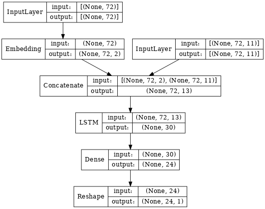
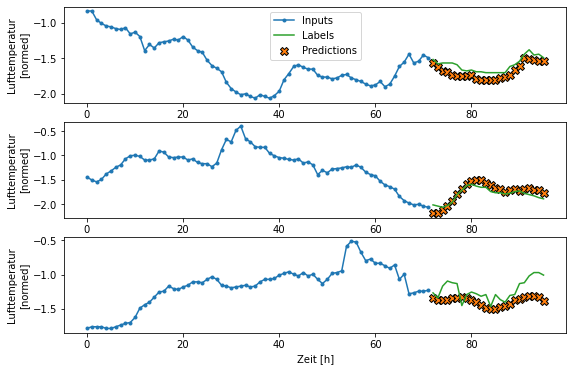
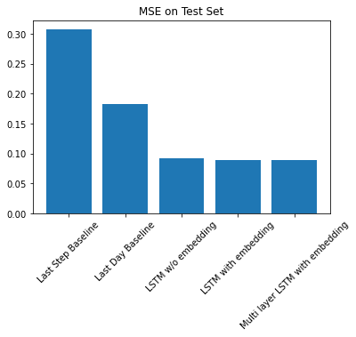

# Salzburg Weather Forecast

Using LSTM to predict temperature for the province of Salzburg, Austria.
Implemented in TensorFlow.

Data is taken from Austria's [open government data platform](https://www.data.gv.at/).

Feature engineering & training leans – quite heavily at times – on TensorFlow's 
[structured time series data tutorial](https://www.tensorflow.org/tutorials/structured_data/time_series).

## How to start developing
### 1. Create conda environment  
This project assumes that a conda installation is available.  

    make environment

 will create a conda environment with all required packages and by default name it after the project directory (_sbg-weather_).

### 2. Load the data
    make sbg_data
    
loads datasets for 2011-2019 from the open government data website and stores it in the `data/raw` directory.

### 3. Data preparation and feature engineering
This is currently handled in the file `01-explore&prep.ipynb` in the notebooks directory. The raw data is processed and eventually stored across several csv files.
The datasets are written to seperate `train`, `val` and `test` folders within `data/processed`.

### 4. Forecasting temperature
In the notebook `02-forecast.ipynb` several LSTM based models are explored and compared against two baselines.  
Input is a multivariate time-series containing hourly measurements of air pressure, temperature, humidity, as well as wind velocity and direction.
72-hour-windows of input data are used to predict temperature for the upcoming 24 hours.
Since the metrics are recorded across several locations throughout Salzburg, the location is provided to the model via an embedding layer.
Including the location achieves a minor performance improvement.

#### Best performing model architecture

#### Model output  

#### Evaluation  

## Sources
* TensorFlow's 
[structured time series data tutorial](https://www.tensorflow.org/tutorials/structured_data/time_series)
* The highly recommended book [Hands On Machine Learning With Scikit-Learn, Keras & TensorFlow](https://www.oreilly.com/library/view/hands-on-machine-learning/9781492032632/)

---

<small>Project based on the <a target="_blank" href="https://drivendata.github.io/cookiecutter-data-science/">cookiecutter data science project template</a>. #cookiecutterdatascience</small>

