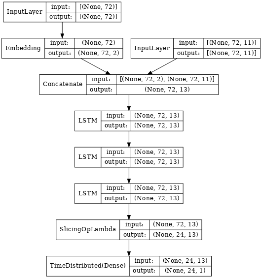
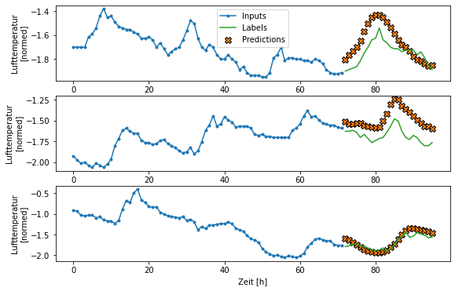

# Salzburg Weather Data

> **NOTE:**  _Currently still work in progress_

Exploring various time-series deep learning methods on weather data for the province of Salzburg, Austria using TensorFlow and Keras.

Data is taken from Austria's [open government data platform](https://www.data.gv.at/).

Data preparation and feature engineering leans – quite heavily at times – on TensorFlow's 
[structured time series data tutorial](https://www.tensorflow.org/tutorials/structured_data/time_series).

## How to start developing
### 1. Create conda environment  
This project assumes that a conda installation is available.  

    make environment

 will create a conda environment with all required packages and by default name it after the project directory (_sbg-weather_).

### 2. Load the data
    make sbg_data
    
loads datasets for the years 2011-2019 to `data/raw`.

### 3. Data preparation and feature engineering

This is currently handled in the notebook `01-explore&prep.ipynb` in the notebooks directory. The raw data is loaded, processed and eventually stored across several csv files.
The files are written to seperate `train`, `val` and `test` folders within `data/processed`.

### 4. Model training
A first example of training an LSTM model is provided in the notebook `02-train.ipynb`.
The input data is a multivariate time series containing hourly measurements of metrics such as air pressure, temperature, wind velocity and direction.
Based on these records, 72-hour-windows of input data are used to predict temperature for the upcoming 24 hours.

#### Current model architecture

#### Model output  

## Sources
* TensorFlow's 
[structured time series data tutorial](https://www.tensorflow.org/tutorials/structured_data/time_series)
* The highly recommended book [Hands On Machine Learning With Scikit-Learn, Keras & TensorFlow](https://www.oreilly.com/library/view/hands-on-machine-learning/9781492032632/)

---

<small>Project based on the <a target="_blank" href="https://drivendata.github.io/cookiecutter-data-science/">cookiecutter data science project template</a>. #cookiecutterdatascience</small>

